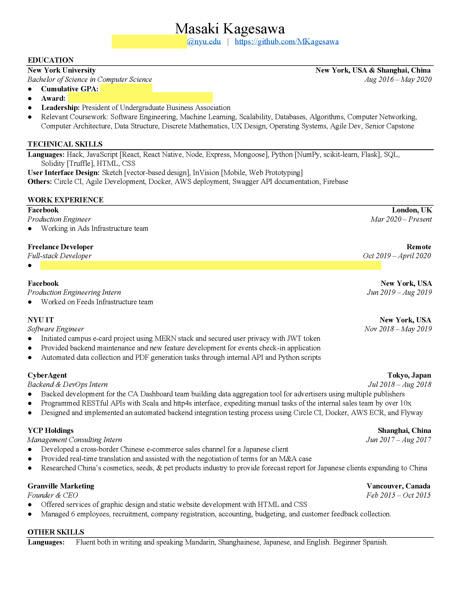

仕事もインターンシップも応募した後まず評価されるのはレジュメ。

いくら面接の準備をしても、書類選考をパスしないと意味がないので今回はレジュメを書く時に注意した点を教えます。日本語と中国語の履歴書も大学１年生の時に作りましたが、更新していないので英語版のみにします。

2020年６月現在、レジュメはこんな感じです。

私の経歴は[LinkedIn](https://www.linkedin.com/in/mkagesawa/)にもっと詳しく書いてます。

"Education"の"award"の部分は奨学金の名前をのせてます。

"Relevant Coursework"は書いていない人も多いですが、多少ニッチなコースを受けた場合リクルーターの目に付くかもしれないと思っているので私は書いています。例えば、Agile Development, Computer Networking, Scalability, UX Designは必須科目ではないので評価につながるかなと思っています。

デザイナーみたいなクリエイティブなデザインしたエンジニアレジュメも時々見ますが、私は一番多くの情報を積み込められるビジネスマンがよく使うテンプレートにしました。リクルーターは各レジュメに5秒以下しか目を通さなく、このフォーマットが一番読みやすいと思います。

アドバイス：

- アクティブ動詞から文を始める。主語を外し, "Automated", "Programmed", "Designed", "Researched", "Managed"など一単語でどんな事をしたのかがわかる様に動詞選びを、その後に使った技術や貢献した内容について書きます。数字でインパクトを表す（売り上げ25%増、コスト10%削減など）のが一番いいですが、私のやったことは定量化ができない事が多かったので、あまりレジュメに数字はないです。
- 見て欲しい部分を上に書く。以前は応募した会社が一番興味を持ってくれそうな経歴は上に書いていました。日本の履歴書とは違い、英語のレジュメは決まったフォーマットがないので、経歴は実際の時間順ではなくても構いません。また、大学１〜２年生のときは"Work Expeirence"と"Technical Skills"の部分にあまり書くものがなかったので、それらの上に"Personal Projects"を付け加え、講義のファイナルプロジェクトや週末自分で作ったサイドプロジェクトなどを書いていました。
- できるだけA4一面いっぱいに書く。空白が多いレジュメは悪印象を残しやすいです。今となって内容が多くので両サイドのマージンを減らしていますが、高校と大学1年生の時はあまり書く事がなかったので、当時は"Other Skills"の部分は"Skills, Activities & Awards" のタイトルで"Languages"意外にも"Certificates"に中国語検定、Courseraで受けた授業などを書き、"Awards"に参加したハッカソン、ビジネスプランコンテスト、マーケティングコンペティション、模擬国連の賞など書きました。"Work Experience"は"Work & Leadership Expeirence"のタイトルで、インターンシップ以外にもビジネスサークルのPresidentをやった経験について書きました。工夫すれば　1ページは埋まります。

過去に何十社も書類で落とされたので、私のレジュメの書き方が正しいとは言えません。あくまでも参考にしてください。