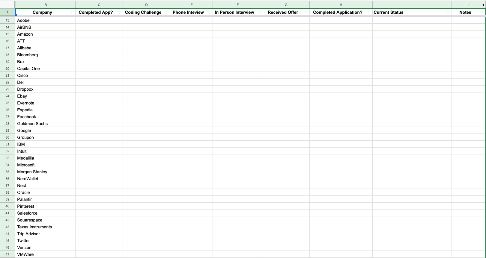
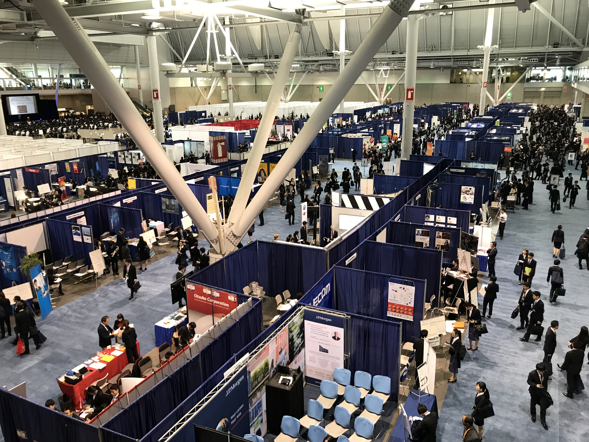
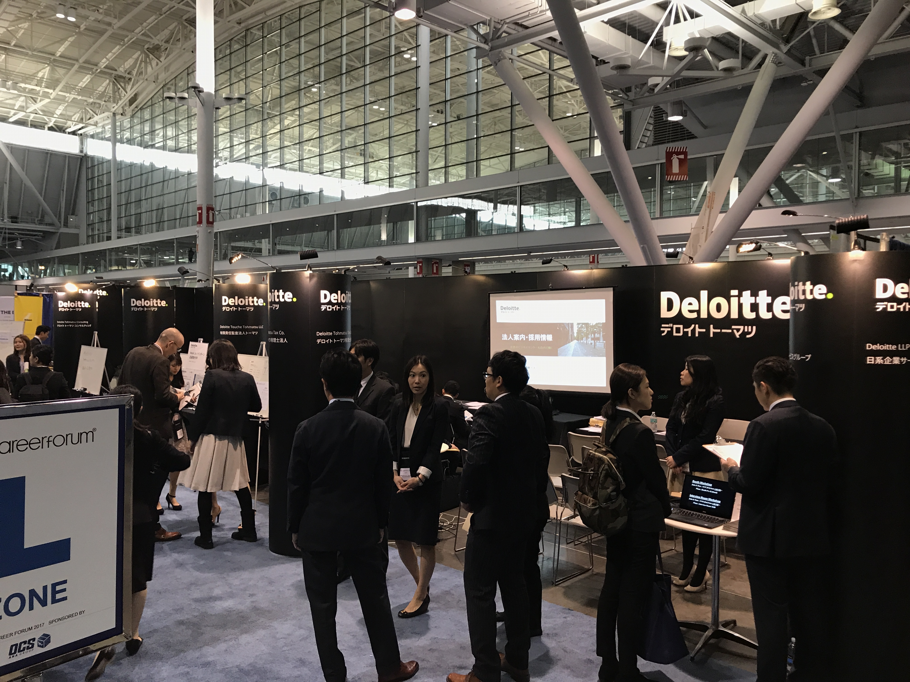
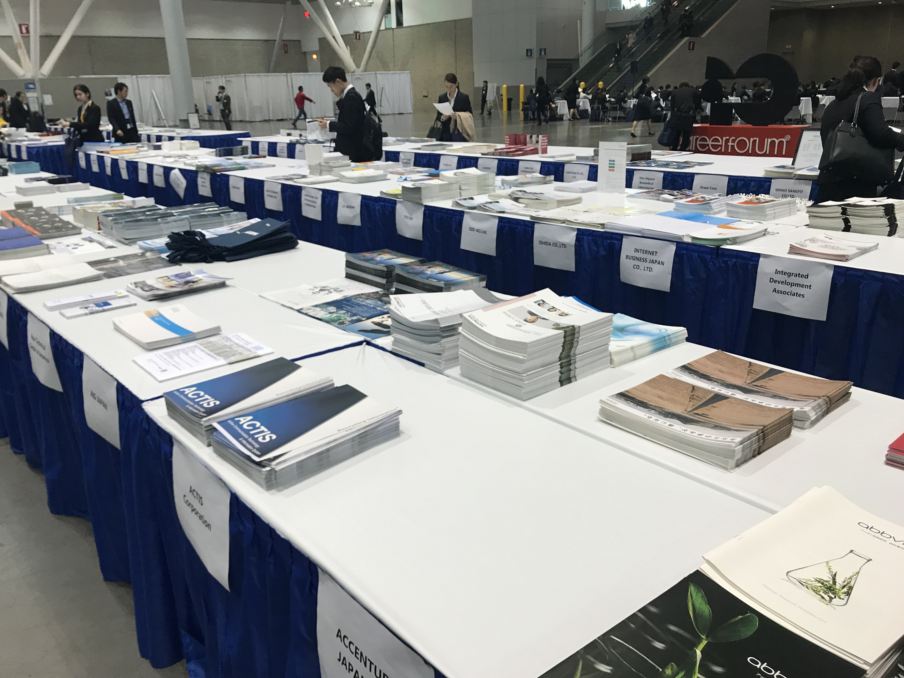

## インターンシップ応募編

応募なんてウェブサイトでエントリーするだけじゃない？と思うかもしれないですが、これも色々な戦略が隠れてます。
今回紹介するのは[リファラル](#リファラル)、応募タイミング（[合格率最大化](#合格率最大化)シナリオと[オプション最大化](#オプション最大化)シナリオ）、[応募量](#量！)、[キャリアリソースセンター](#大学のキャリアリソースセンターを使う)、[キャリアフェア](#キャリアフェアは意味がない)、[ボスキャリ](#ボストンキャリアフォーラムに行く)についてです。

### リファラル

Referralとは応募したい会社の現社員から推薦をもらうことです。

通常の企業ウェブサイトでエントリーするのではなく、特殊なURLから応募する様になります。

テック会社は金融系と比べてreferralはそれほど大事ではなく、私もほとんどの会社はreferralなしで応募してました。

しかしrefarralがあるとやはりレジュメをきちんとみてもらえ、採用スピードもグッと上がります。人気の会社は毎年数百万人応募するのでレジュメが弱いとすぐに落とされたり、長い間を待たされることがよくあります。

全て個人の体験ですが、referralなしの場合リクルーターがしっかりしている大企業ですと数週間〜数ヶ月で次の採用ステップに入るか、不採用か結果が出ますけど、中企業（ツイッター、Spotify）などですと６〜１０ヶ月くらい待たされることがよくあります。

もうサマーインターンをしてる時に去年応募したのが不採用と通知が来たりします。

これがrefarralがありの場合、大企業は数日〜数週間、中企業は数ヶ月です。

ほとんどのスタートアップはビザスポンサーをしなく、私は応募しなかったのでどれくらい時間がかかるかは分からないです

日本みたいにインターンシップは一律採用されないので応募するスケジュールを計画しないといけないです。２つの戦略を紹介します。

### 合格率最大化

日本では決められた時にエントリーして、一律採用されるのが普通ですが、多くのアメリカ企業ではRolling-baseと言われ応募された順に採用されます。

早めに応募した方がまだ採用のhead countが多く余ってるので合格しやすいです。なのでどこの企業でもいいのでオファーが欲しい場合はアプリケーションが開始したらすぐに応募するのがお勧めです。

### オプション最大化

ほとんどのオファーは期限付き（通常数週間）なのでたくさんのオファーから選びたい場合は企業の採用スピードに合わせて応募するタイミングを決める必要があります。大雑把には中企業を大企業よりも早めに応募することです。

オファーを同じ時期にもらうとオプションが増える他、リクルーターと場所や入るチームをnegotiateができます。

インターンシップの場合はほぼ無理ですが新卒採用の場合給料も上げれます。自慢話みたいになるから、他に受かった企業をリクルーターに伝えたくない人もいますが、伝えて損することはないです。

その他アドバイス：

### 量！

多くインターンシップが見つからない人は量で負けてます。
私は毎年20社以上のインターンシップに応募してました。

アプリケーションの形式はどれも似てるのでコピペするだけです。任意のカバーレターは時間がかかるので書かなかったです。

まず応募したい企業のリストを作って、片っ端から応募していくのをお勧めします。

*Fig 1. 私が使っていたリスト*

### 大学のキャリアリソースセンターを使う

企業のウェブサイトから直接応募する前にまず、自分の大学のキャリアセンターがその企業とすでに関係をもち、大学経由で応募ができないかをチェックしておくべきです。

会社からリクルーターやエンジニアが来るイベントなどは頻繁に参加していました。実際にどのような仕事をしているのかを聞く機会にもなりますし、時々自分の大学専用応募リンクを渡されることもあります。

私の経験ではこれらのリンクはrefarralほど効果は大きくないけど、通常応募と比べたら有利です。

もし特殊リンクがなく、通常のサイトで応募してくださいと言われた場合は相手の名刺かメールアドレスをもらい、応募する時に声をかけていました。そうすると目を通してもらえる確率が若干増えます。

イベント以外でも多くの大学は学生専用のキャリアサイトを持ってます。私の大学の場合は[Handshake](https://joinhandshake.com/universities/)を使っていました。ここで応募した場合もちゃんと見てもらえます。

大学経由のもう一つの長所は、インターンシップ後内定をもらった場合、企業は大学のオファー期限ルールに従います。通常のオファーは3週間くらいですが、大学経由だと２ヶ月まで伸ばしてもらえたりします。この間に他社からもオファーをもらえれば選択肢が増え、negotiationにも使えます。

### キャリアフェアは意味がない

私の意見ですが、周りの友達で誰もCareer Fairを通して行きたい企業に入れた人はいないです。有名企業は常に20~30人並んでおり、数分しか質問ができないのでコスパが非常に悪いです。毎回参加して得たものは企業のロゴがついてるグッズくらいです。

唯一役に立ったと聞いた話は、大学一年生の時にcareer fairを通して小さな会社でインターンオファーをもらったくらいです。

### ボストンキャリアフォーラムに行く

通称[ボスキャリ](https://careerforum.net/ja/event/bos/)　これはアメリカ大学に通ってる日本人の独特チャンスなので行っておくと損しないです。私は大学２年生と３年生の時に行きました。金融系が多かったイメージですが、Amazon JP, Mercari, Bitflyerなども2018年は参加していました。

トラベルスカラシップ も提供されていますので交通費と宿泊費を抑えられます。

*Fig 2. ボスキャリ会場の様子*

*Fig 3. 企業が説明会など行っていた*

*Fig 4. 色んな会社の紹介パンフレット*

ブログを読んで何か質問があったらツイッターで@して聞いてください😄